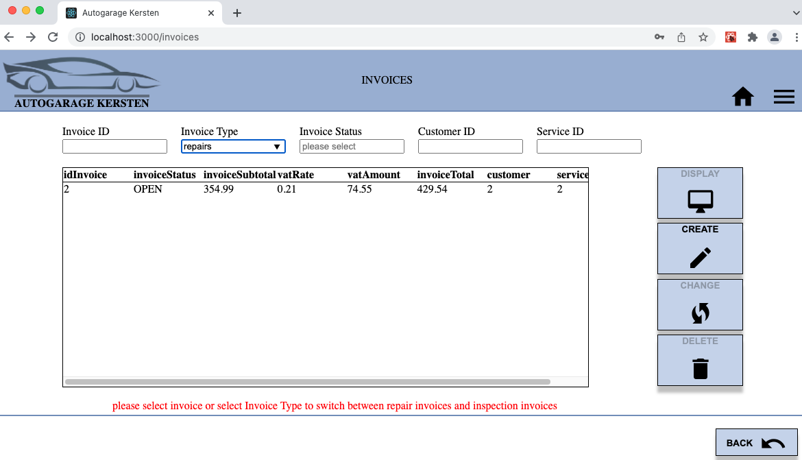

# Welkom bij de web applicatie die ontwikkeld is voor autogarage kersten 

De volgende onderwerpen zullen in deze readme worden behandeld:
- Introductie van de applicatie
- Beschrijving van de casus
- De applicatie opstarten
- Standaard inlog accounts
- Een impressie van de applicatie

# Introductie
Deze applicatie is ontwikkeld als eindopdracht voor de opleiding Full-Stack Developer, leerlijn frontend van Novi Hogeschool en onderdeel van de bachelor opleiding Software Development. 

Deze front-end applicatie is geschreven in HTML, CSS, JavaScript met React als library.
Installatie handleidingen en andere documentatie zijn niet meegeleverd op github maar kunnen desgevraagd worden aangeleverd.

# Beschrijving van de casus
**De eindopdracht is ontwikkeld op basis van onderstaande casus:**

In de garage komen klanten hun auto afleveren voor een reparatie. Een administratief medewerker voegt de klant en de auto toe aan het systeem, wanneer de klant en of de auto voor het eerst bij de garage komen. De medewerker plant vervolgens een moment in om de auto te keuren. Tijdens deze registratie kunnen de autopapieren in pdf-formaat toegevoegd worden.

Een monteur keurt vervolgens de auto en voegt de gevonden tekortkomingen toe aan de auto in het systeem. Nadat de auto gekeurd is, neemt de monteur contact op met de klant. Gaat de klant akkoord met de reparatie, dan maakt de monteur een afspraak om de auto te repareren.

Gaat de klant niet akkoord met de reparatie dan zet de monteur dat in het systeem, maakt hij de bon op voor de keuring, à 45 euro, en kan de klant de auto komen ophalen en wordt de reparatie op 'niet uitvoeren' gezet.

Wanneer de klant akkoord gaat, voegt de monteur toe wat afgesproken is en gaat hij de auto repareren. Elk onderdeel dat gebruikt wordt, wordt toegevoegd aan de reparatie. Ook wordt elke handeling gedocumenteerd. Vervangt de monteur bijvoorbeeld de remschijf dan wordt het onderdeel remschijf aan de reparatie toegevoegd en wordt de handeling remschijf vervangen aan de reparatie toegevoegd.

Al deze onderdelen en handelingen staan al, inclusief prijs, in het systeem. De monteur kan deze opgeslagen handelingen en onderdelen selecteren. Omdat een monteur soms iets specifieks moet doen, kan de monteur ook een 'overige' handeling en prijs toevoegen.

Wanneer de reparatie voltooid is, wordt de reparatie op voltooid gezet en kan de klant opgebeld worden. De klant wordt opgebeld door een administratief medewerker. Deze medewerker kan een lijst opvragen met te bellen klanten waarvan de reparatie voltooid is of de status 'niet uitvoeren' is.

Wanneer de klant de auto komt ophalen zal een kassamedewerker de bon laten genereren door het systeem. De bon bevat de keuring + bedrag, de handelingen + bedrag en de onderdelen + bedrag. Bij alle bedragen moet het BTW tarief nog berekend worden voordat de bedragen op de bon getoond worden. Wanneer de klant betaald heeft, wordt de status op betaald gezet.

Daarnaast is er een backoffice medewerker die onderdelen (naam, prijs, voorraad) kan toevoegen aan het systeem, voorraden kan aanpassen en handelingen (naam, prijs) kan toevoegen aan het systeem. Alle prijzen in het systeem zijn exclusief BTW. 

# De applicatie opstarten
Bij deze applicatie hoort een installatie handleiding welke stap voor stap uitlegd welke applicaties geinstalleerd moeten worden en welke handelingen verricht moeten worden om de applicatie op te starten.

Daarnaast heeft deze front-end applicatie een eigen ontwikkelde backend applicatie welke geinstalleerd en gekoppeld aan een databse dient te worden, ook hiervan is een uitgebreide installatie handleiding beschikbaar.
De link naar de backend applicatie op github: 
https://github.com/RoyKersten/autogarage_backend_update_rker

Mocht je beide installatiehandleidingen hebben gelezen en stap voor stap de installties hebben uitgevoerd dan kan deze frontend applicatie (vanuit bijvoorbeeld Webstorm) opgestart worden.
-   Type in de terminal van Webstorm **npm install**
-   Type in de terminal van Webstorm **npm start**

Als alles goed is gegaan zal de applicatie nu draaien op addres **localhost:3000** en verschijnt onderstaande pagina om in te loggen.

# Standaard inlog accounts
In de installatie handleiding is een overzicht weergegeven van aangemaakte gebruikers met bijbehorende wachtwoorden.
Deze standaard gebruikers kunnen worden gebruikt om de applicatie te gebruiken of men kan nieuwe gebruikers met specifieke autorisatie rollen aanmaken middels de admin rol.

# Een impressie van de applicatie
De homepage met alle modules:

Overzicht van alle klanten met makkelijke zoek functies:

De mogelijkheid om op basis van het kenteken autogegevens op te halen via een API koppeling met het opendata systeem van het RDW.
Upload functionaliteit voor de autopapieren in pdf formaat.

Voorraad administratie tot in detail met automatische bijwerking van verbruikte hoeveelheden tijdens reparaties:

Service registratie tot in detail met automatische controle van beschikbare hoeveelheden en toegepaste prijzen uit de voorraad administratie:

Facturatie van keuringen en reparaties met automatsiche calculatie van de de verbruikte onderdelen en uitgevoerde activiteiten uitgesplitst op de factuur:

Rapportage over de service status, eenvoudig inzicht in de status van een service en met welke klanten contact opgenomen dient te worden:

Managen van gebruikers en autorisaties, stel autorisaties per gebruiker eenvoudig in en bepaal wat een gebruiker wel of niet mag uitvoeren.
Deze applicatie maakt gebruik van een JWT token met een ingestelde geldigheidsduur van 2 uur nadat een gebruiker succesvol is ingelogd.

